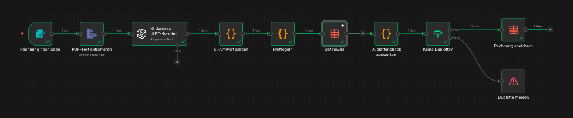
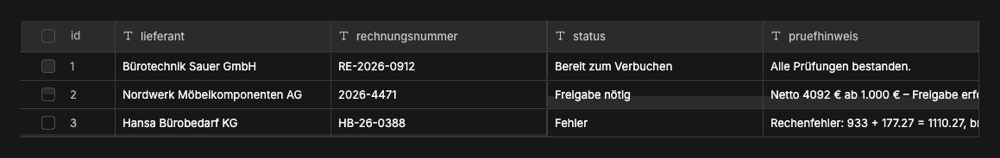
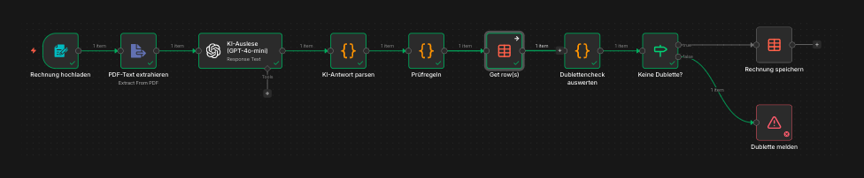

# Rechnungsverarbeitung mit Prüfung & Dublettenschutz

Nimmt Eingangsrechnungen als PDF entgegen, liest sie per KI aus, **prüft** sie
automatisch und schützt vor Doppelverbuchung – bevor irgendetwas gespeichert wird.

Gebaut mit [n8n](https://n8n.io) (selbst gehostet) und GPT-4o-mini.

> **In English:** n8n workflow that reads incoming supplier invoices (PDF) with GPT-4o-mini,
> validates totals, flags invoices above an approval threshold and blocks duplicates before
> anything is stored.

---

## Das Problem

Bei der Nordlicht Büroeinrichtung GmbH tippt jemand die Daten aus jeder Lieferantenrechnung von Hand in die Buchhaltung: Lieferant, Betrag, MwSt, Fälligkeit. Das ist
zeitraubend, fehleranfällig – und die teuerste Falle ist, dieselbe Rechnung versehentlich
**zweimal** zu bezahlen.

## Die Lösung

Ein Workflow, der die Rechnung ausliest, selbstständig prüft und nur *saubere, neue*
Rechnungen strukturiert ablegt – als geprüfte Grundlage für die Buchhaltung.

---

## Wie es funktioniert

1. **Rechnung hochladen** – ein Formular nimmt die Rechnung als PDF entgegen.
2. **Text extrahieren** – der PDF-Text wird ausgelesen.
3. **KI-Auslese (GPT-4o-mini)** – ein Prompt zieht Lieferant, Rechnungsnummer, Datum,
   Fälligkeit, Netto, MwSt, Brutto und IBAN als sauberes JSON heraus.
4. **Automatische Prüfungen:**
   - **Pflichtfelder** – fehlen Rechnungsnummer, Netto, MwSt oder Brutto (oder liefert die
     KI kein gültiges JSON), wird die Rechnung als *Fehler* markiert statt durchgewunken.
   - **Rechen-Check** – stimmt Netto + MwSt = Brutto? (Rundungstoleranz berücksichtigt)
   - **Freigabe-Schwelle** – ab 1.000 € netto wird die Rechnung als *Freigabe nötig* markiert.
   - **Dublettencheck** – existiert die Rechnungsnummer bereits, wird sie als *Dublette*
     erkannt.
5. **Entscheidung (IF-Node):** Nur Rechnungen, die **keine Dublette** sind, werden in die
   Tabelle geschrieben. Dubletten werden nicht gespeichert, sondern über einen
   *Stop and Error*-Node sichtbar gemeldet: Die Ausführung erscheint als fehlgeschlagen,
   mit Rechnungsnummer im Fehlertext. Mit einem n8n-Error-Workflow lässt sich daraus
   automatisch eine Benachrichtigung machen.
6. **Speichern** – die geprüfte Rechnung landet mit Status und Prüfhinweis in einer Tabelle.

---

## Status-Werte

| Status | Bedeutung |
|---|---|
| Bereit zum Verbuchen | Alle Prüfungen bestanden |
| Freigabe nötig | Netto ab 1.000 € – braucht menschliche Freigabe |
| Fehler | Pflichtfeld fehlt oder Rechen-Check fehlgeschlagen |
| Dublette | Rechnungsnummer schon vorhanden – wird nicht gespeichert, sondern gemeldet |

---

## Eingesetzte Technik

- **n8n** – Workflow-Orchestrierung (selbst gehostet, DSGVO-freundlich)
- **Extract from File** – Text aus dem Rechnungs-PDF
- **GPT-4o-mini** – strukturierte Extraktion aus unstrukturiertem Rechnungstext
- **JavaScript (Code-Nodes)** – Prüflogik, Dublettenerkennung, Aufbereitung
- **IF-Node** – Verzweigung: speichern vs. verwerfen
- **n8n Data Table** – Nachschlagen (Dublettencheck) und Speichern

---

## Aufbau des Workflows

Der Dublettencheck (`Get row(s)`) läuft bewusst als **Seitenzweig**, nicht im Hauptweg:
Ein Datenbank-Lesevorgang ohne Treffer gibt in n8n keine Elemente zurück und würde den
Hauptfluss unterbrechen. Die Prüf-Logik schlägt das Ergebnis daher per Referenz nach –
so läuft jede Rechnung zuverlässig bis zur Entscheidung durch.

---

## Zum Ausprobieren

Im Ordner `beispiele/` liegen drei fiktive Rechnungen:

| Datei | Erwartetes Ergebnis |
|---|---|
| `muster-rechnung-1.pdf` | Bereit zum Verbuchen (815,00 € netto) |
| `muster-rechnung-2.pdf` | Freigabe nötig (4.092,00 € netto) |
| `muster-rechnung-3-rechenfehler.pdf` | Fehler (Brutto um 10 € zu hoch) |
| eine davon ein zweites Mal hochladen | Dublette |

---

## Installation

1. `workflow/rechnungsverarbeitung.json` in n8n importieren (*Workflows → Import from File*).
2. Eigene Credentials hinterlegen (OpenAI) – nicht im Export enthalten.
3. Eine Data Table `Rechnungseingang` anlegen mit den Spalten
   `lieferant, rechnungsnummer, rechnungsdatum, faelligkeit` (String),
   `netto, mwst, brutto` (Number), `iban, status, pruefhinweis` (String).
4. In **Get row(s)** und **Rechnung speichern** die Tabelle einmal aus der Liste neu
   anklicken – erst dann ist sie wirklich verknüpft. „Rechnung speichern“ nutzt
   *Map Automatically*: Die Felder heißen exakt wie die Spalten.

---

> **Hinweis:** Demo-Case für eine fiktive Firma (Nordlicht Büroeinrichtung GmbH).
> Bereinigter Export – Instanz-, Tabellen- und Credential-Referenzen sind durch
> Platzhalter ersetzt.
